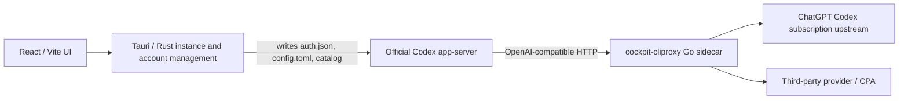
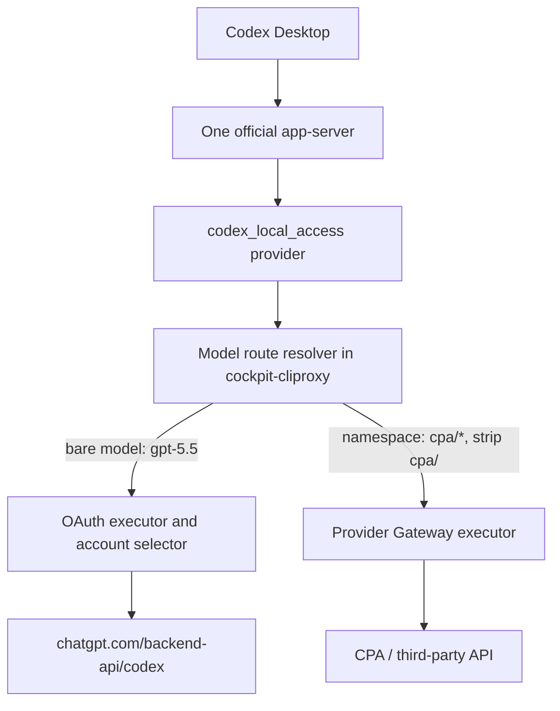
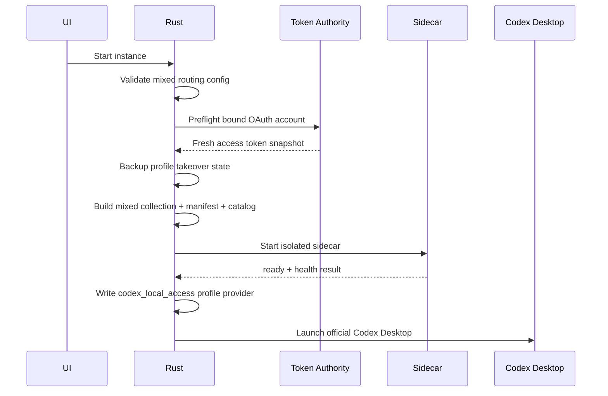

# Codex Desktop Mixed Model Routing Design

## Status

- Repository baseline: `upstream/main` at `18055d05`, Cockpit Tools `v1.3.34`.
- Scope: local work-in-progress implementation on `codex/mixed-model-routing`.
- Isolation: the feature is default-off and has only been exercised with the
  development data directory; the installed Cockpit Tools profile is unchanged.
- Decision: the feature is feasible as an opt-in extension of the existing
  `cockpit-cliproxy` sidecar. It does not require a custom `codex-server` or a
  second Codex `app-server`.

## User Goal

One Codex Desktop instance keeps one directly signed-in ChatGPT/Codex subscription
account, while selected models use configured third-party API accounts:

```text
gpt-5.5          -> directly signed-in subscription OAuth
cpa/gpt-5.5      -> CPA API, upstream model gpt-5.5
cpa/grok-4.6     -> CPA API, upstream model grok-4.6
deepseek/deepseek-v4-flash -> DeepSeek API
```

The source is determined by the full client-visible model ID. A GPT model under
an API namespace is still an API model. It must never silently fall back to the
subscription route.

## Current Architecture

Cockpit Tools currently has four relevant layers:



Important current behavior:

1. An instance has one `bind_account_id` in
   [`src-tauri/src/models/instance.rs`](../src-tauri/src/models/instance.rs).
2. API Key accounts may bind an OAuth account. Cockpit then writes OAuth identity
   and an API provider override into the same profile. This is identity dual-track,
   but requests still use one instance-wide `model_provider`.
3. The profile takeover implementation already backs up and restores managed
   `auth.json` and `config.toml` state.
4. `cockpit-cliproxy` already reads the request JSON model, validates the model,
   selects OAuth credentials, calls Provider Gateway endpoints, translates
   Responses/Chat Completions, streams responses, and records usage diagnostics.
5. A current `apiKeySpec` chooses either OAuth execution or one
   `ProviderGateway` for the whole client key. It does not choose by model.

## Feasibility Assessment

### Feasible without another app-server

The official Codex `app-server` already owns conversation state, rollout files,
tool approvals, shell execution, fork/archive behavior, and model selection. The
selected model is included in the HTTP request body received by the sidecar.
Therefore the egress decision can be made after the app-server has chosen the
model and before the upstream request is sent.

Running two app-servers would create unnecessary state ownership problems:

- conversation and rollout synchronization;
- duplicate approval/tool state;
- cancellation and streaming ownership;
- fork/archive consistency;
- OAuth refresh-token competition;
- recovery after either server exits.

The design keeps exactly one official app-server.

### Confirmed reusable capabilities

- Model IDs allow `/`, so names such as `cpa/gpt-5.5` pass Cockpit catalog
  validation.
- The sidecar receives the actual selected model in request JSON.
- Provider Gateway already supports model rewrite, request translation, streaming,
  vision capability checks, and provider header isolation.
- Profile takeover already has backup and restoration behavior.
- Sidecar OAuth auth files intentionally exclude `refresh_token`; Cockpit remains
  the token authority and avoids competing with the official client for a
  one-time refresh token.

### Validation status

- Confirmed by automated tests:
  - slash-namespaced IDs are preserved in the managed catalog and resolved by the
    sidecar;
  - bare models use the isolated OAuth route while namespaced models use the API
    route;
  - OAuth access-token updates reach a running sidecar without copying the
    refresh token;
  - partial profile takeover failure restores the previous profile snapshot.
- Still required before production readiness:

1. Confirm Codex Desktop can complete a real slash-namespaced request through a
   disposable desktop instance.
2. Confirm compaction behavior for API-routed models.
3. Confirm capability behavior for Responses WebSocket, web search, image input,
   image generation, and realtime endpoints.

## Proposed Architecture



The instance remains logged in with the existing bound OAuth account. Cockpit
changes only the model HTTP egress by pointing the instance at one local sidecar.

## Persistent Data Model

Do not overload `bind_account_id`.

- `bind_account_id`: the direct login identity. When mixed routing is enabled it
  must resolve to an OAuth subscription account.
- `model_routing`: independent API egress configuration.

Proposed Rust shape:

```rust
#[derive(Debug, Clone, Serialize, Deserialize, Default)]
#[serde(rename_all = "camelCase")]
pub struct CodexInstanceModelRouting {
    #[serde(default)]
    pub enabled: bool,
    #[serde(default = "default_model_routing_version")]
    pub version: u32,
    #[serde(default)]
    pub routes: Vec<CodexInstanceApiRoute>,
}

#[derive(Debug, Clone, Serialize, Deserialize)]
#[serde(rename_all = "camelCase")]
pub struct CodexInstanceApiRoute {
    pub id: String,
    pub namespace: String,
    pub provider_account_id: String,
    #[serde(default = "default_true")]
    pub enabled: bool,
}
```

Add `model_routing` with `#[serde(default, skip_serializing_if = "Option::is_none")]`
to both `InstanceProfile` and `DefaultInstanceSettings`. Existing stores deserialize
without migration, and disabled or absent routing uses the exact current launch
path.

Validation rules:

- mixed routing is Desktop App only in the first release;
- `bind_account_id` must be a real OAuth account, not API Service, Provider Gateway,
  API Key, Agent Identity, or an unbound profile;
- every route account must be an enabled API Key account with a usable Base URL,
  API key, wire API, and non-empty model catalog;
- namespaces are lowercase, unique, 2-32 characters, and match
  `[a-z0-9][a-z0-9_-]*`;
- reserved namespaces include `official`, `subscription`, `openai`, `codex`, and
  internal Cockpit model IDs;
- deleting or disabling an API account leaves the instance configuration visible
  but invalid. Launch fails with a precise validation error until repaired;
- failure policy is fixed to strict in v1 and is not user-configurable.

## Generated Sidecar Contract

Keep the existing API key behavior untouched when `modelRouting` is absent.

Proposed manifest extension:

```json
{
  "apiKeys": [
    {
      "id": "instance_mixed_123",
      "key": "local-client-secret",
      "enabled": true,
      "accountIds": ["oauth-account-id"],
      "modelRouting": {
        "defaultRoute": "oauth",
        "failurePolicy": "strict",
        "routes": [
          {
            "id": "route-cpa",
            "namespace": "cpa",
            "providerAccountId": "api-account-id",
            "providerGateway": {
              "baseUrl": "https://cpa.example/v1",
              "apiKey": "secret",
              "wireApi": "responses",
              "upstreamModels": ["gpt-5.5", "grok-4.6"]
            }
          }
        ]
      }
    }
  ]
}
```

The frontend never receives provider secrets. Rust resolves `provider_account_id`
to the current account record and materializes the generated manifest only in the
local sidecar runtime directory with hardened permissions.

## Request Routing Algorithm

Routing must happen before the existing provider-wide canonicalization removes
information from the client model ID.

```text
1. Authenticate the local client API key.
2. Parse the raw request model.
3. Remove only the API key's outer modelPrefix, if configured.
4. If modelRouting is absent, execute the existing code unchanged.
5. If the model starts with a configured namespace plus "/":
   a. select that API route;
   b. strip exactly one namespace prefix;
   c. reject an empty upstream model;
   d. verify the upstream model is in that route's provider catalog;
   e. execute through that route's Provider Gateway.
6. If the model contains a namespace that is missing, disabled, or invalid:
   return model_route_not_available. Never fall back to OAuth.
7. Otherwise treat it as a bare model:
   a. verify it is visible as an official/subscription model;
   b. select only the bound OAuth account;
   c. execute through the existing OAuth path.
8. Record both clientModel and upstreamModel plus route kind/id.
```

Examples:

| Client model | Route | Upstream model |
| --- | --- | --- |
| `gpt-5.5` | OAuth subscription | `gpt-5.5` |
| `cpa/gpt-5.5` | CPA Provider Gateway | `gpt-5.5` |
| `cpa/grok-4.6` | CPA Provider Gateway | `grok-4.6` |
| `missing/gpt-5.5` | error | none |

Do not use heuristic routing such as "all GPT goes official". Namespace ownership
is the routing contract.

## Model Catalog and Model Management UI

The source should be visible in the existing model manager without adding source
metadata to Codex's catalog JSON. Cockpit can derive the source from the model ID
and active instance routes.

### Instance edit page

Insert a new section between **绑定账号** and **自定义启动参数**:

```text
模型路由
  [toggle] 混合模型路由（实验）

  登录渠道
  liu@example.com    订阅 OAuth    正常

  API 渠道
  CPA       namespace: cpa       2 models       正常     [编辑] [删除]
  DeepSeek  namespace: deepseek  2 models       正常     [编辑] [删除]

  [+ 添加 API 渠道]
```

Behavior:

- default is off;
- enabling requires an OAuth account in the existing account selector;
- API channel picker lists API Key accounts only;
- namespace is suggested from provider ID/name and remains editable;
- save performs local validation but does not modify a running instance silently;
- a running instance shows **保存并重启** or **仅保存，稍后生效**;
- the instance list continues to show the OAuth login account and adds a compact
  **混合路由** status next to it. It must not display CPA as the login identity.

### Model manager

Add a **来源** column:

| 展示名 | 模型 ID | 来源 | 推理强度 | 上下文与压缩 |
| --- | --- | --- | --- | --- |
| 5.5 | `gpt-5.5` | 订阅 | 跟随官方 | 跟随模型 |
| 5.5 CPA | `cpa/gpt-5.5` | CPA | 跟随官方 | 跟随模型 |
| Grok 4.6 CPA | `cpa/grok-4.6` | CPA | 跟随官方 | 516K/460K |

When adding a model, use a source selector:

```text
来源: [订阅 | API 渠道]

订阅:
  model ID = gpt-5.5

API 渠道:
  channel = CPA
  upstream model = grok-4.6
  generated model ID = cpa/grok-4.6
```

The generated namespaced ID is editable only through the channel namespace or
upstream model fields, preventing accidental route/source mismatch.

Route-derived UI states:

- `订阅`: no configured namespace prefix;
- provider name: prefix matches one enabled route;
- `路由缺失`: prefix exists in the model ID but no route owns it;
- `账号不可用`: route exists but its provider account is missing/disabled;
- `模型不存在`: upstream model is no longer in the provider account catalog.

## Lifecycle and Rollback

### Launch



The safer order is sidecar-ready before launching Codex. If sidecar startup or
health validation fails, restore the profile backup and do not start the app.

### Update while running

Do not rewrite an active sidecar manifest in place. Save the desired instance
configuration, then perform an explicit controlled restart:

1. stop Codex Desktop for that instance;
2. stop the instance sidecar;
3. build a new sidecar directory and manifest atomically;
4. start and probe the new sidecar;
5. apply profile takeover and restart Codex;
6. remove the old runtime directory only after success.

### Disable or delete

- stop only the sidecar owned by that profile and routing configuration;
- restore the existing takeover backup;
- remove only Cockpit-managed model catalog/provider fields;
- preserve unrelated user `config.toml` keys and existing user changes;
- if restore fails, keep the backup and show a blocking recovery action;
- disabling mixed routing must not disable the global API Service or other
  Provider Gateway instances.

## OAuth Token Refresh

The isolated mixed sidecar must not receive a refresh token. Add a profile-sidecar
credential refresh coordinator:

1. runtime state records `profile_dir`, `sidecar_auth_dir`, and OAuth account IDs;
2. before access-token expiry, Rust calls the existing managed-account refresh;
3. Rust atomically rewrites the matching sidecar auth file;
4. the sidecar file watcher reloads the access token;
5. refresh errors update instance route health but do not switch to an API route;
6. stopping the sidecar cancels its refresh task.

This avoids refresh-token races and prevents a mixed instance from working only
until the initial access token expires.

## Endpoint Capability Policy

The primary target is Codex Desktop text/coding traffic over POST Responses.
Other endpoints require explicit behavior:

| Capability | Subscription model | API model v1 policy |
| --- | --- | --- |
| `POST /v1/responses` | OAuth | Provider Gateway |
| Streaming Responses | OAuth stream | Provider stream/translation |
| Tool schemas and tool output | existing path | existing provider translation path |
| Image input | official capability | provider capability/vision route |
| `POST /v1/responses/compact` | OAuth | provider only when declared; otherwise strict error |
| Responses WebSocket | supported when enabled | disabled in v1 unless provider explicitly supports it |
| `alpha/search` web search | OAuth | unsupported in v1 unless an API route implements it |
| Codex Live / Realtime | OAuth only | unsupported in v1 |
| Image generation/edit endpoints | OAuth policy | separate provider capability, not inferred from text routing |

For the first implementation, disable `prefer_websockets` for the entire mixed
instance unless per-model WebSocket routing is implemented. SSE remains the
consistent transport for both routes.

Compaction must never fall back from an API model to OAuth because that would send
third-party conversation content to the subscription upstream. Unsupported
capabilities fail clearly and remain visible in the UI.

## CPA and Privacy Boundary

CPA and `cockpit-cliproxy` are not byte-for-byte blind tunnels. They parse and may
transform the complete request/response JSON to handle model names, Responses vs
Chat Completions, tool schemas, images, streaming, retries, and usage. They do not
perform model inference, but they can technically see conversation content and
tool parameters.

Cockpit's request-log database should continue to store metadata only. Add two
hardening rules for mixed routing:

- persist `routeKind`, `routeId`, `providerAccountId`, `clientModel`, and
  `upstreamModel`, but never prompt or response bodies;
- sanitize and bound stored `error_message` so an upstream error cannot echo and
  persist request content. Full raw upstream bodies may only appear in an explicit,
  temporary debug mode and must be redacted before issue export.

Provider requests must use a newly created HTTP request with:

- only the route's API key in `Authorization`;
- no OAuth bearer token or `Chatgpt-Account-Id`;
- only the existing allowlisted diagnostic headers;
- no unrelated provider headers from another route.

## Health and Diagnostics

Add a per-instance route health result:

```text
subscription: ready / token_refresh_due / auth_failed
cpa: ready / account_missing / catalog_empty / provider_unreachable / auth_failed
deepseek: ready / capability_limited / provider_unreachable
```

Launch health checks should validate configuration and local sidecar readiness.
They should not send a paid model request automatically. The UI can provide an
explicit **测试路由** command that sends a minimal user-authorized request and
shows:

- client model;
- resolved route and provider;
- upstream model;
- protocol;
- latency and HTTP status;
- no prompt/response body in persistent diagnostics.

## Compatibility Guardrails

1. `model_routing` absent or disabled executes the current code path without a
   mixed sidecar or new catalog behavior.
2. Existing OAuth-only, API Key, API Service, Provider Gateway, CLI, DeepSeek
   direct/CDP, and account-pool modes remain valid.
3. V1 rejects mixed routing for CLI launch mode rather than changing CLI behavior.
4. Existing `ProviderGateway` manifest fields remain supported; `modelRouting` is
   additive.
5. All new Rust fields use serde defaults and optional serialization.
6. No automatic migration converts an existing CPA instance into mixed mode.
7. No fallback crosses trust boundaries. Route errors are explicit.

## Test Matrix

### Go sidecar unit tests

- bare official model resolves to OAuth;
- `cpa/gpt-5.5` resolves to CPA and rewrites body model to `gpt-5.5`;
- third-party GPT never selects OAuth;
- missing/disabled namespace returns `model_route_not_available`;
- route catalogs are merged into `/v1/models` with namespaced IDs;
- duplicate/reserved namespaces are rejected;
- provider and OAuth headers never cross routes;
- API route errors do not trigger OAuth retry;
- route diagnostics include client and upstream models;
- mixed mode absent preserves current tests unchanged.

### Rust tests

- old instance stores deserialize with no routing config;
- mixed config validation accepts OAuth + API route and rejects every invalid
  account combination;
- generated manifest contains no route when disabled;
- generated manifest materializes current provider secrets only at runtime;
- profile takeover backup/restore is idempotent;
- sidecar startup failure restores profile state;
- token refresh rewrites all active profile-sidecar auth files for that account;
- stopping one instance does not stop another instance's sidecar;
- deleting an API account marks dependent routes invalid without deleting them.

### Frontend tests

- toggle defaults off;
- API routes are hidden when off and preserved when toggled back on before save;
- OAuth/API account pickers use the correct account types;
- source column derives subscription/API/missing states correctly;
- API model creation generates the namespace ID;
- running instance save presents restart choices;
- validation errors prevent save and focus the affected route/model.

### Local end-to-end acceptance

Use a new isolated test instance. Do not modify the user's current default or CPA
instances.

1. `gpt-5.5` completes through the signed-in subscription account.
2. `cpa/gpt-5.5` completes through CPA.
3. `cpa/grok-4.6` completes through CPA.
4. Route logs prove the selected route and upstream model for each request.
5. Continue one conversation while switching models and verify history remains in
   one app-server thread.
6. Verify shell, `apply_patch`, approvals, cancellation, fork, archive, restore,
   sub-agent, image input, and session reopen.
7. Force/await OAuth access-token refresh and verify the running instance continues.
8. Exercise a long context to observe compaction behavior.
9. Disable mixed routing and verify the profile restores and ordinary Cockpit
   instance operations still work.

## Delivery Phases

### Phase 0: technical spike

- add sidecar-only route resolution behind an internal development flag;
- use a fake local upstream to prove namespace stripping and header isolation;
- run one real slash-model request through a disposable Codex Desktop instance;
- verify token refresh and compaction before committing to the full UI.

### Phase 1: hidden experimental implementation

- persistent instance routing schema;
- Rust mixed collection/manifest builder;
- sidecar strict model router;
- isolated lifecycle and token-refresh coordinator;
- no public UI beyond a guarded developer switch.

### Phase 2: instance and model UI

- instance route editor;
- model source column and source-aware add flow;
- route health, restart confirmation, and diagnostics;
- localization and frontend tests.

### Phase 3: capability expansion

- per-model Responses WebSocket support;
- provider compact/search capabilities;
- optional image-generation routes;
- CLI support only after Desktop behavior is stable.

## Bridge Fallback

A custom `CODEX_CLI_PATH` bridge or separate CodexSplit-style server remains a
fallback, not the first implementation. Use it only if the technical spike proves
that the official app-server rewrites namespaced models before the sidecar, does
not send the selected model reliably, or requires an unhookable transport path.

The bridge has a larger blast radius because it replaces or wraps app-server
startup and protocol handling. The current sidecar route design preserves more of
Cockpit Tools and the official Codex client unchanged.

## Final Recommendation

Proceed with the sidecar-based design, but treat Phase 0 as a mandatory go/no-go
gate. The central architecture is sound; the highest-risk items are long-running
OAuth token delivery and capability parity, not basic model routing. Keep the
feature default-off, Desktop-only, strict-failure, and isolated to a disposable
test instance until the acceptance matrix passes.
